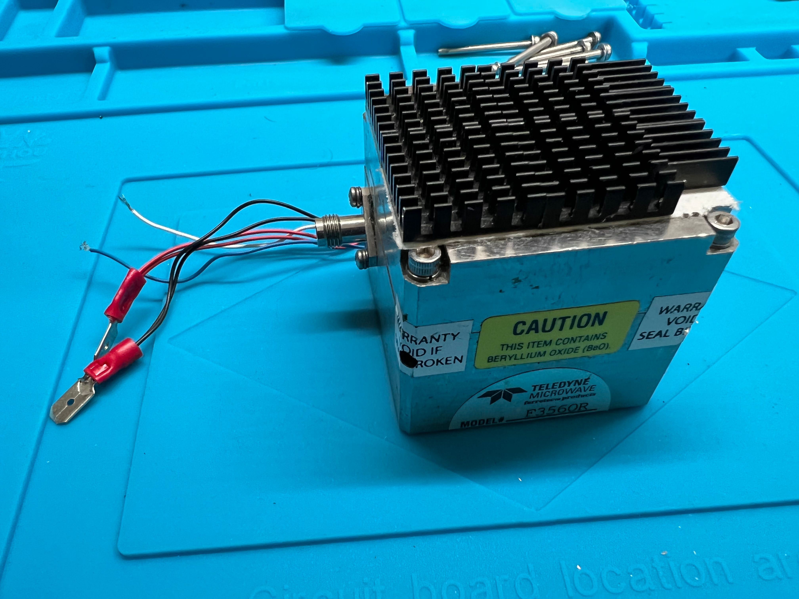
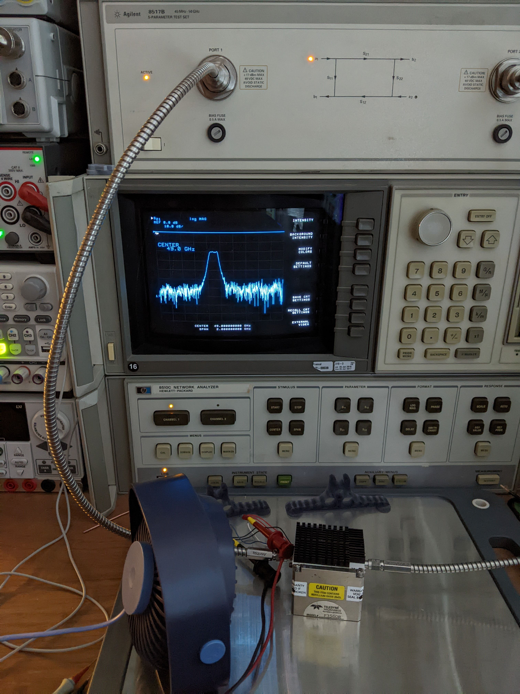

# F3560R Characterization

I snatched a nifty YIG filter off ebay the other day. I bought it on account of the 1.85mm connectors, as they suggested a frequency range that was relevant to my interests. Of course, it was still a gamble, so the next step was to characterize the filter and see if the gamble paid off. This repo tells the story of said characterization.

Spoiler alert: it paid off :)

## Measurement Setup

* Programmable Power Supply: GPP-4323
* VNA to 50GHz: HP 8510C
* SNA above 50GHz: Marki quadruplers & mixers, Centellax amplifier, SignalHound spectrum analyzer

### VNA to 50GHz

### SNA above 50GHz

## Passband Response

This module's "deliverable" is a current-controlled bandpass characteristic. Put in a current I, get a bandpass centered at frequency f. Up to 50GHz, this can characterized  with my repaired 8510C network analyzer. Results:

<a href="https://jjoonathan.github.io/sweep1.html">

Click for Live

</a>

* _F3560R Data Gathering.ipynb_: controls instruments, conducts measurement
* _F3560R YIG Data Fit.ipynb_: fits a highly empirical model
* _F3560R YIG Polynomial Fit.ipynb_: attempts to compress the model

## Leakage Response

Above 50GHz, I have to use an "improvised" scalar analysis setup. The noise floor is rather high, but it demonstrates an important point: the energy demand to drive the YIG coil goes parabolic at 60GHz, where the high-permeability alloy starts to saturate. However, the YIG becomes leaky between 65GHz and 75GHz, and this could be used to extend the useful range of a spectrum analyzer slightly beyond the nominal upper frequency limit of the YIG! Cool!

## I(f) -- Current Demand

The frequency is controlled by current, so the key engineering question is: how much current (and power) is required for a given frequency? A quantitative answer to this question allows for frequency planning and controller design.

## Residuals

How good is the polynomial spline model at capturing the slow frequency response of the YIG? The residual plot tells us.

